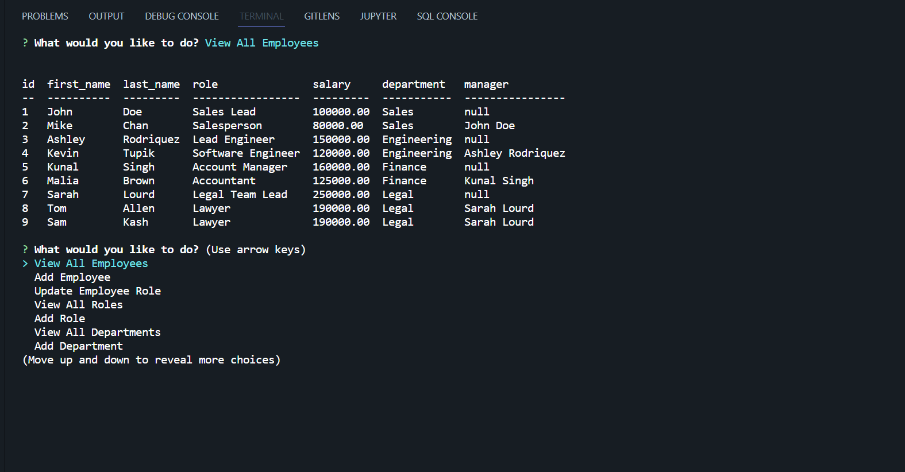
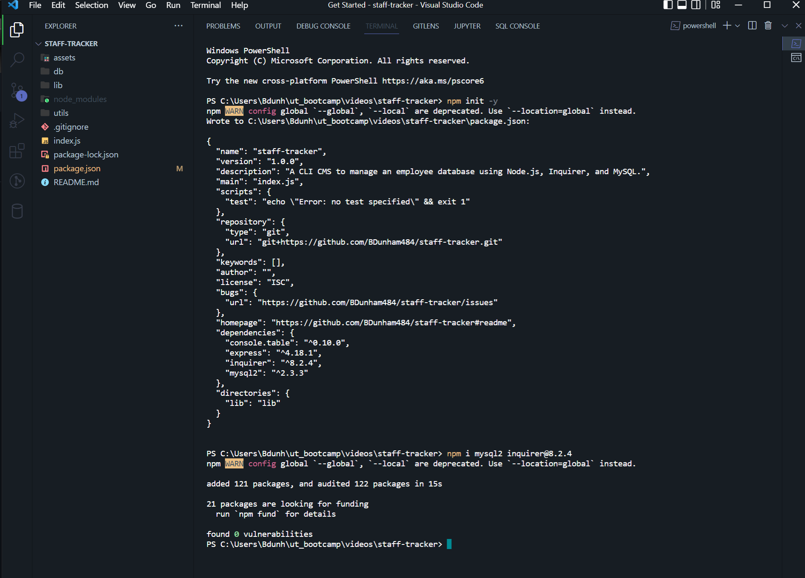

# staff-tracker  

## Description: 

* A CLI CMS to manage an employee database using Node.js, Inquirer, and MySQL

* <a href='https://github.com/BDunham484/staff-tracker'>https://github.com/BDunham484/staff-tracker</a>

## Table of Contents

- [Installation](#installation)
- [Usage](#usage)
- [License](#license)
- [Code Contributors](#code-contributors)
- [Contributing](#contributing)
- [Test](#test)
- [Questions](#questions)

## Installation

* After cloning the repository
*  Enter `npm init -y` in the command line
*  Followed by `npm i mysql2 inquirer@8.2.4`

## Usage

* To begin, enter `node index` in the command line.  You will then be presented with the initial prompt to begin the application

## License

* This application is covered under the <a href='https://opensource.org/licenses/MIT'>MIT License</a>.

## Made with

* JavaScript
* Node.js
* MySQL
* Inquirer v. 8.2.4

## Made with ❤️ by:

* Brad Dunham

Back to [top of page](# )

    
